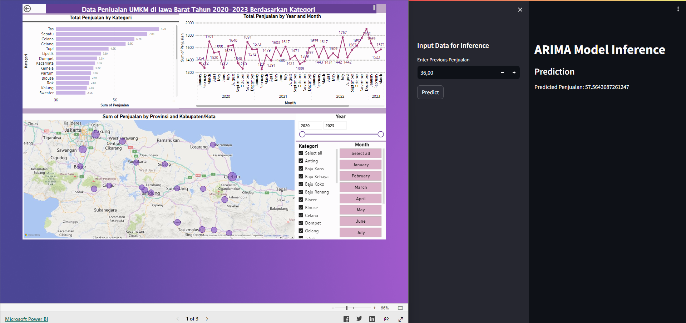

# Prediksi Permintaan Pasar untuk UMKM di Desa

## Screenshots

## Link Demo:

 - [PowerBI](https://app.powerbi.com/view?r=eyJrIjoiZTk3YWUwNWUtOTE0Yy00OGMzLWFlNjQtOTQ3MWY0YzcyNGYwIiwidCI6IjQ4N2Y4Y2RhLWEzMjctNGIwZC05Y2M0LWEyNTI4NTMzM2NkMCIsImMiOjEwfQ%3D%3D)
 - [Streamlit](http://20.198.255.159)
 - [Youtube](https://youtube.com)

## **Latar Belakang:**

Platform Prediksi Permintaan Pasar untuk UMKM di Desa dirancang untuk membantu UMKM di daerah pedesaan merencanakan produksi mereka dengan lebih efisien berdasarkan estimasi permintaan pasar yang akurat. Dengan memanfaatkan teknologi AI, platform ini akan menganalisis berbagai faktor termasuk data historis penjualan, tren pasar, musiman, serta variabel lainnya untuk memberikan perkiraan yang dapat dipercaya tentang permintaan produk tertentu di wilayah-wilayah tersebut. Dengan demikian, UMKM dapat mengurangi risiko overstock atau understock, meningkatkan efisiensi produksi, dan mengoptimalkan pendapatan mereka.

## Fitur Utama:

1. **Historical Data Analysis:**
    - Platform akan mengumpulkan dan menganalisis data historis penjualan UMKM, termasuk informasi tentang produk, jumlah penjualan, dan lokasi penjualan.
    - Melakukan analisis tren dan pola penjualan dari data historis untuk memahami perilaku konsumen dan faktor-faktor yang memengaruhi permintaan.
2. **Demand Prediction:**
    - Menggunakan teknik-teknik machine learning dan algoritma prediksi untuk menghasilkan perkiraan permintaan pasar di berbagai wilayah.
    - Memperhitungkan faktor-faktor seperti musim, peristiwa khusus, dan tren pasar untuk meningkatkan akurasi prediksi.
3. **Data Visualization:**
    - Menyajikan hasil prediksi dalam bentuk grafik dan dashboard yang mudah dipahami.
    - Memungkinkan UMKM untuk melihat perkiraan permintaan produk mereka dalam berbagai periode waktu dan wilayah.
4. **Production Recommendations:**
    - Berdasarkan hasil prediksi, platform akan memberikan rekomendasi kepada UMKM tentang jumlah produksi yang optimal untuk produk tertentu.
    - Menghitung risiko overstock atau understock untuk membantu UMKM mengambil keputusan yang tepat dalam merencanakan produksi.

## Rencana Implementasi:

**Minggu 1: Perencanaan dan Persiapan Data**

- Merancang struktur platform dan mengidentifikasi sumber data historis yang diperlukan.
- Menyiapkan infrastruktur untuk pengumpulan, penyimpanan, dan pengolahan data.

**Minggu 2-3: Pengembangan Model Prediksi**

- Tim AI akan mengembangkan model prediksi menggunakan teknik machine learning seperti regresi, time series analysis, atau neural networks.
- Menganalisis dan menyesuaikan model berdasarkan hasil validasi dan pengujian.

**Minggu 4: Integrasi dan Pengujian**

- Mengintegrasikan model prediksi ke dalam platform dan mengembangkan antarmuka pengguna yang intuitif.
- Melakukan pengujian fungsionalitas dan akurasi prediksi menggunakan data real-time dan historis.

**Minggu 5: Peluncuran dan Evaluasi**

- Meluncurkan platform secara resmi kepada UMKM di desa-desa dan memfasilitasi pelatihan penggunaan platform.
- Mengumpulkan umpan balik dari pengguna dan melakukan evaluasi untuk memperbaiki dan meningkatkan platform.

Dengan platform Prediksi Permintaan Pasar untuk UMKM di Desa, diharapkan UMKM dapat mengoptimalkan produksi mereka sesuai dengan permintaan pasar yang fluktuatif, meningkatkan efisiensi operasional, dan meningkatkan pendapatan mereka secara keseluruhan.
